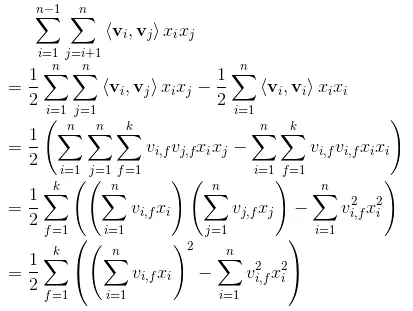

# Fatorization Machine FM

Fatorization machine FM 实现

1. 公式

这里考虑FM的输入是只有一个**field \(fields一般有 User， Item， Tag等不同的fields。如果在DeepFM里面有多个fields（每个field有多个embedding vectors和对应的feature values）, 那么就先把每个field里面的embedding vectors先加起来，这样每个field对应一个pooling后的embedding vector， 之后再做FM的交叉**\)的feature vector x （**只有一个field直接FM交叉多个embedding vectors，如果有多个field，先pooling embedding vector使每个field只有一个embedding后再交叉**）, 里面可以是continuous value也可以是sparse value，每个value都有对应的embedding vector，交叉时要把continuous value和 embedding vector element-wise相乘作为rescale，而sparse feature作为lookup table的形式选择


2. 化简

第二项可以化简成一个 时间复杂度为O\(kn\)的计算形式， FM的计算是完全是线性的, 这也是FM的一个相对于传统人工交叉特征的优势

另外如果最外层的loop 不把k个value相加，就会得到一个交叉后的embedding vector， 这个vector可以用作Neural FM的DNN的输入进行学习





3. PyTorch Code

```python
# Fatorization machine pytorch 实现
import torch
from torch import nn
class FM(nn.Module):
  def __init__(self,fea_dim, embed_dim ,reduce_sum = True):
    super(FM, self).__init__()
    self.reduce_sum = reduce_sum
    self.linear = nn.Linear(fea_dim, 1)
    # embedding matrix
    self.V = nn.Parameter(torch.randn(fea_dim, embed_dim))


  def forward(self, x):
    """
    x: input with shape: (batch_size, feature vector dim before embedding)

    Note
      1. fields in FM usually contain User, Item, Tag, different fields mean different profile of user, item, other factor
      2. FM: y = b + \sum_^n_i w_i*xi + \sum^n_i \sum^n_{j=i+1} <vi, vj>xi*xj
      这里的xi, xj 不管是sparse还是continuous value 它都有自己的对应的embedding， 并且是 vi*xi 把这个continuous value 和 embedding rescale
      3. \sum^n_i \sum^n_{j=i+1} <vi, vj>xi*xj 交叉项可以简化成 0.5*\sum^k_f=1 ( (\sum^n_i(vi*xi))^2 - \sum^n_i(vi^2*xi^2) )
      这样计算只有O(kn)的时间，并且如果是 只需要vector而不用reduce dimension到scalar value，就可以简单去掉 \sum^k_f=1 的loop
    """
    linear_output = self.linear(x).squeeze() #  # Linear combination
    sum_square = torch.pow(torch.matmul(x, self.V),2) # x: (batch, n), self.V: (n, embed_dimension)
    square_sum = torch.matmul(torch.pow(x,2),torch.pow(self.V,2))
    cross_fea = 0.5*(sum_square - square_sum)
    if self.reduce_sum:
      # Note: cross_fea has shape (batch size, dimension in a field) , there is only one field
      # torch.sum(dim=1): sum alone dimension of shape[1], that is along dimension of a field
      cross_fea = torch.sum(cross_fea, dim= 1)
      return linear_output+cross_fea
    return linear_output ,cross_fea


n, fea_dim,  emb_dim = 10, 5, 8
x = torch.rand((n, fea_dim))
fm = FM(fea_dim= fea_dim, embed_dim=emb_dim, reduce_sum=True)
fm2 = FM(fea_dim= fea_dim, embed_dim=emb_dim, reduce_sum=False)
y = fm(x)
y2 = fm2(x)
# torch.sum(y[1],dim=1)
y,y2
```


4. Reference

[https://github.com/rixwew/pytorch-fm/blob/f74ad19771eda104e99874d19dc892e988ec53fa/torchfm/layer.py\#L64](https://github.com/rixwew/pytorch-fm/blob/f74ad19771eda104e99874d19dc892e988ec53fa/torchfm/layer.py#L64)

